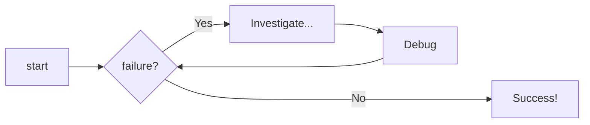
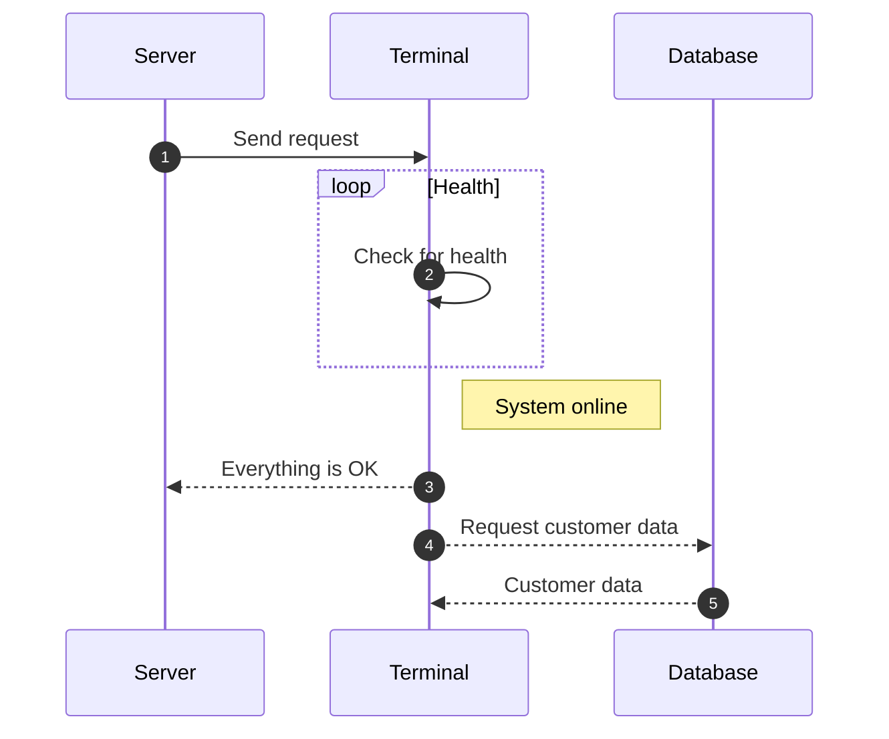

# Diagram Examples

## Types of Diagrams

### Flowcharts

Used to represent workflows or processes. The steps
are rendered as nodes of various kinds and are connected by edges, describing
the necessary order of steps:

```` markdown title="Example Code"

````

<div class="result" markdown>
Result


</div>

### Sequence diagrams

Are used to describe a specific scenario as sequential interactions 
between multiple objects or actors, including the messages that are exchanged
between those actors:

```` markdown title="Example Code"

````

<div class="result" markdown>
Result


</div>