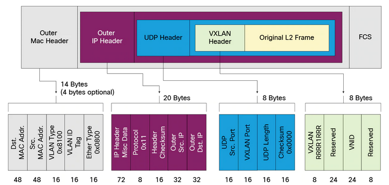

# VXLAN (Virtual Extensible LAN)
---
## **Overview**

VXLAN (Virtual Extensible LAN) is a network virtualization technology that addresses the scalability issues associated with large cloud computing deployments. It encapsulates Layer 2 Ethernet frames within Layer 3 UDP packets, allowing for the creation of a virtualized Layer 2 network over a Layer 3 infrastructure.

---
## **Key Features**

- **Scalability**: Supports up to 16 million logical networks.
- **Flexibility**: Allows for the extension of Layer 2 networks across Layer 3 boundaries.
- **Isolation**: Provides network isolation similar to VLANs but with greater scalability.

---
## **How VXLAN Works**

VXLAN uses a 24-bit segment ID, known as the VXLAN Network Identifier (VNI), to uniquely identify each virtual network. This VNI is included in the VXLAN header, which encapsulates the original Ethernet frame. The encapsulated packet is then transmitted over the IP network using UDP.

---
## **VXLAN Packet Structure**

*Below is a diagram showing the structure of an Ethernet frame with VXLAN encapsulation:*

??? "VXLAN Encapsulation Diagram"

    
    
    *Image Source:* [Cisco Community](https://community.cisco.com/t5/image/serverpage/image-id/70232iF697164B92AD1285/image-size/large?v=v2&px=999)
    
---
## **Relevant RFCs and Standards**

- **RFC 7348**: Defines the VXLAN protocol and its encapsulation format.
- **IEEE 802.1Q**: Standard for VLAN tagging, which VXLAN builds upon.

---
## **Benefits of VXLAN**

- **Enhanced Network Segmentation**: Provides better network segmentation compared to traditional VLANs.
- **Improved Utilization of Network Resources**: Optimizes the use of available network resources by leveraging existing IP networks.
- **Simplified Network Management**: Eases the management of large-scale networks by reducing the complexity of VLAN configurations.

---
## **Use Cases**

- **Data Center Interconnect**: Connects multiple data centers over a shared IP network.
- **Cloud Computing**: Supports multi-tenant environments by providing isolated virtual networks for different tenants.
- **Disaster Recovery**: Facilitates disaster recovery by enabling seamless network extension across geographically dispersed locations.

---
> ## ***References***

1. [RFC 7348 - Virtual eXtensible Local Area Network (VXLAN): A Framework for Overlaying Virtualized Layer 2 Networks over Layer 3 Networks](https://tools.ietf.org/html/rfc7348)
2. [IEEE 802.1Q - IEEE Standard for Local and Metropolitan Area Networks--Bridges and Bridged Networks](https://standards.ieee.org/standard/802_1Q-2018.html)
